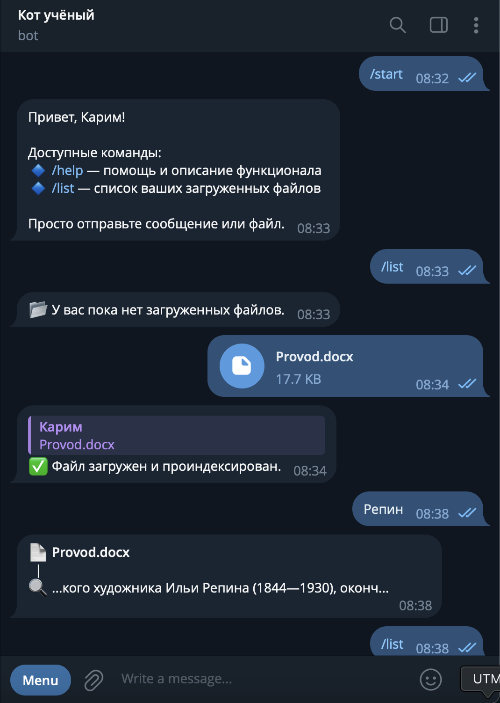
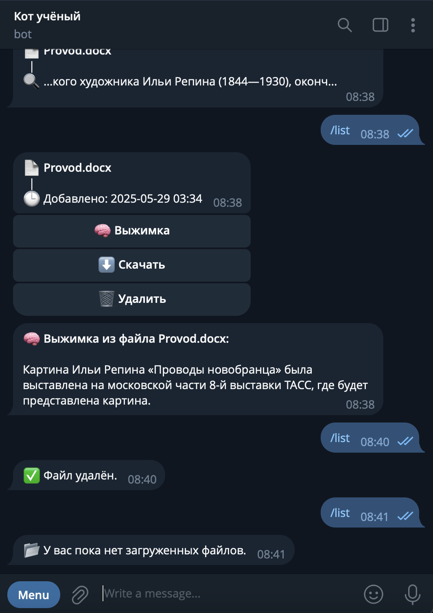
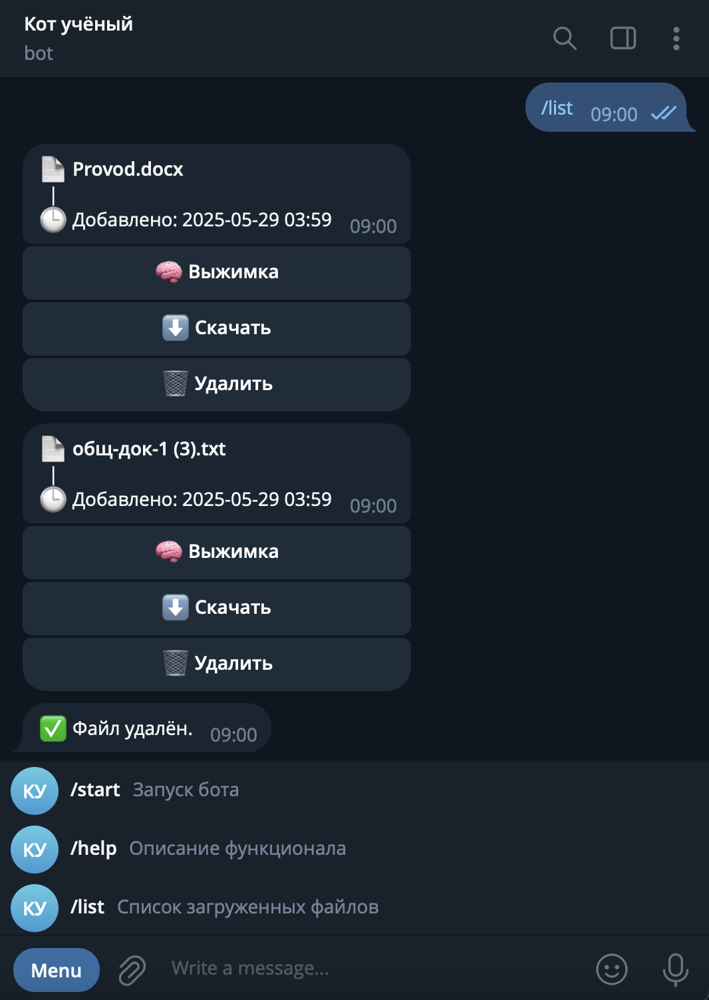

# 🐱 Cat Read — Telegram бот для работы с научными файлами

**Cat Read** — это офлайн Telegram-бот, который помогает работать с научной литературой: загружать документы, искать по ним текст, получать выжимку и управлять файлами — всё прямо из чата.

---

## 📦 Возможности

- 📤 Загрузка и хранение PDF, DOCX, TXT
- 🔍 Полнотекстовый поиск по содержимому
- 🧠 Резюме (суммаризация) текста через локальную LLM
- 📁 Просмотр списка файлов
- 🗑 Удаление и ⬇ скачивание файлов
- 🗃 Сохранение в SQLite + индексация Whoosh

---

## 🧠 Как работает поиск

Для быстрого и эффективного поиска используется библиотека **Whoosh** — лёгкий, но мощный инструмент полнотекстового индексирования на Python. После загрузки и распознавания текста документ разбивается на токены и сохраняется в индекс. Поиск выполняется мгновенно и находит как точные фразы, так и подстроки.

---

## 🤖 Выжимка текста (Summarization)

Cat Read использует локальную модель из библиотеки 🤗 `transformers` — **mT5 (multilingual T5)**. Это многоязычная модель, способная обрабатывать и сокращать тексты на более чем 50 языках. Поддержка офлайн-режима позволяет использовать бота без постоянного подключения к внешним API.

Пример использования модели:
- Выделяется основной смысл даже из больших академических текстов
- Не требуется интернет, модель подгружается и кэшируется локально
- Работает быстро и эффективно на современных ПК

---

### Необходимо просто отправить файл для его подгрузки или слово для поика по нему

### Резюме файла используя суммаризатор

### Скачивайте и удаляйте документы со свой библиотеки

### Поиск в милисекунды по всем файлам сразу


###

## 🚀 Быстрый старт

### 1. Клонируй проект
```
git clone https://github.com/yourusername/cat-read.git
```
### 2. Пререйди в склонированную директорию
```
cd cat-read
```
### 3. Создай виртуальное окружение (опционально)
```
python3 -m venv .venv
```
### 4. Для GNU Linux / MacOS
```
source .venv/bin/activate
```
### 5 Для Windows
```
.venv\Scripts\activate
```
### 6. Сгенерируй токен в телеграм @BotFather
```
echo "BOT_TOKEN=ваш_токен" > .env
```
### 7. Установи зависимости 
```
pip install -r requirements.txt
```
### 8. Запусти бота и ожидай "🤖 Бот запущен..."
```
python main.py
```

#По всем вопросам писать в telegram @hevilim
